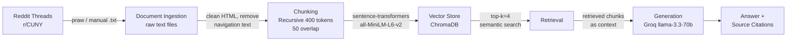

# Project 1 Planning: The Unofficial Guide

> Write this document before you write any pipeline code.
> Your spec and architecture diagram are what you'll use to direct AI tools (Claude, Copilot, etc.) to generate your implementation — the more specific they are, the more useful the generated code will be.
> Update the Retrieval Approach and Chunking Strategy sections if you change your approach during implementation.
> Update this file before starting any stretch features.

---

## Domain

CUNY financial aid from the student perspective — specifically the unofficial 
knowledge students share on Reddit about TAP, Pell, disbursements, and refunds. 
This information is hard to find officially because it reflects real student 
experiences, edge cases, and timeline realities that official CUNY docs don't address.

---

## Documents

<!-- List your specific sources: URLs, subreddit names, forum threads, or file descriptions.
     Aim for at least 10 sources that together cover different subtopics or perspectives within your domain. -->

| # | Source | Description | URL or location |
|---|--------|-------------|-----------------|
| 1 | r/CUNY | Does a WU mess up my financial aid? | https://www.reddit.com/r/CUNY/comments/18t5glp/does_a_wu_mess_up_my_financial_aid/ |
| 2 | r/CUNY | Financial aid refunds | https://www.reddit.com/r/CUNY/comments/1qazy8g/financial_aid_refunds/ |
| 3 | r/CUNY | Paying for college except we're really broke | https://www.reddit.com/r/CUNY/comments/1mvuvho/paying_for_college_except_were_really_broke/ |
| 4 | r/CUNY | Is it possible to get 100% financial aid? | https://www.reddit.com/r/CUNY/comments/1fcypzx/is_it_possible_to_get_100_financial_aid_and_is/ |
| 5 | r/CUNY | Is my financial aid going to go down? | https://www.reddit.com/r/CUNY/comments/1hh5lgd/is_my_financial_aid_going_to_go_down/ |
| 6 | r/CUNY | Understanding financial aid (Pell + TAP calculation) | https://www.reddit.com/r/CUNY/comments/1tby95i/understanding_financial_aid/ |
| 7 | r/CUNY | Financial aid disbursement megathread FAQ | https://www.reddit.com/r/CUNY/comments/117wgdi/financial_aid_disbursement_megathread_faq/ |
| 8 | r/CUNY | How much am I supposed to pay? | https://www.reddit.com/r/CUNY/comments/1jcyrhz/how_much_am_i_supposed_to_pay/ |
| 9 | r/CUNY | Guide to financial aid refunds, Pell, TAP | https://www.reddit.com/r/CUNY/comments/x94w0o/a_guide_to_financial_aid_refunds_pell_tap_and/ |
| 10 | r/CUNY | Can Pell or TAP pay for summer classes? | https://www.reddit.com/r/CUNY/comments/1frqjkg/can_pell_or_tap_pay_for_summer_classes/ |

---

## Chunking Strategy

<!-- How will you split documents into chunks?
     State your chunk size (in tokens or characters), overlap size, and explain why those
     numbers fit the structure of your documents.
     A review-heavy corpus warrants different chunking than a long FAQ. -->

**Chunk size:** 400 tokens

**Overlap:** 50 tokens

**Reasoning:** Reddit threads are naturally structured by comments, where each comment 
represents one person's complete thought on a specific aspect of the question. Recursive 
chunking respects these comment boundaries by splitting on paragraph/newline breaks first 
before going deeper. Fixed chunking was ruled out because financial aid answers vary 
greatly in length. Semantic chunking was ruled out because Reddit comments are already 
separated by meaning — the structure does that work for us.

---

## Retrieval Approach

<!-- Which embedding model are you using (e.g., all-MiniLM-L6-v2 via sentence-transformers)?
     How many chunks will you retrieve per query (top-k)?
     If you were deploying this for real users and cost wasn't a constraint, what tradeoffs
     would you weigh in choosing a different embedding model — context length, multilingual
     support, accuracy on domain-specific text, latency? -->

**Embedding model:** all-MiniLM-L6-v2 (via sentence-transformers)

**Top-k:** 4

**Production tradeoff reflection:** We chose k=4 as a middle ground — if k is less 
than 3 that risks missing relevant chunks, if k is more than 5 then that risks feeding 
the LLM too much irrelevant text and confusing it, so 4 hits the sweet spot between 
coverage and precision. If deploying for real users, I would consider OpenAI's 
text-embedding-ada-002 for higher accuracy, but it costs money per API call and 
requires an internet connection. all-MiniLM-L6-v2 runs locally with no rate limits 
or cost, which is ideal for this project. A multilingual model would also be worth 
considering since some CUNY students may write in Spanish or other languages. Context 
length is less of a concern here since Reddit comments are short.

---

## Evaluation Plan

<!-- List your 5 test questions with their expected correct answers.
     Questions should be specific enough that you can judge whether the system's response
     is right or wrong. "What are good dining halls?" is too vague.
     "What do students say about wait times at [dining hall name] during lunch?" is testable. -->

| # | Question | Expected answer |
|---|----------|-----------------|
| 1 | If I withdrew from a class but stayed above 12 credits (full time), will it affect my financial aid? | No negative impact on financial aid as long as you remain full time (12+ credits) |
| 2 | If I was full time fall and spring, can financial aid cover full time summer classes? | TAP generally does not cover summer; Pell may cover summer depending on remaining eligibility |
| 3 | What happens to my financial aid if I fail classes and my GPA drops to 1.7? | Bad academic standing can put aid on probation or suspension; SAP requirements must be met |
| 4 | Is it possible to get full tuition covered and still get a refund check? | Yes, if Pell + TAP exceed tuition cost the remainder is refunded to the student |
| 5 | If you get a financial aid refund, what should you do with it? | Students recommend using it for books, housing, or saving it — not spending it immediately |

---

## Anticipated Challenges

<!-- What could go wrong? Name at least two specific risks with reasoning.
     Consider: noisy or inconsistent documents, missing source attribution, off-topic
     retrieval, chunks that split key information across boundaries. -->

1. Reddit comments are informal and sometimes incorrect — a student might give bad 
advice and the system could retrieve and present it as fact. This is a retrieval 
quality risk since the embedding model has no way to distinguish accurate information 
from misinformation.

2. While CUNY generally operates under the same financial aid rules, individual 
colleges can vary significantly in practice — for example, Queens College may take 
longer to disburse aid than LaGuardia, or estimated aid letters may be delayed 
depending on the staff working that week. Since our documents are pulled from general 
r/CUNY threads rather than college-specific sources, the system may give answers that 
are accurate for one campus but misleading for another.

3. Some threads have key information split across multiple comments, meaning one chunk 
alone won't have the full answer. For example, the OP might ask a question in one 
comment and the actual answer is spread across 3 reply comments — if our chunking 
splits these apart, retrieval may only return part of the context and the LLM won't 
have enough to generate a complete answer.

---

## Architecture

<!-- Draw a diagram of your pipeline showing the five stages:
     Document Ingestion → Chunking → Embedding + Vector Store → Retrieval → Generation
     Label each stage with the tool or library you're using.
     You can use ASCII art, a Mermaid diagram, or embed a sketch as an image.
     You'll use this diagram as context when prompting AI tools to implement each stage. -->

**Pipeline Summary:**

1. **Reddit Threads r/CUNY** — 10 source documents, manually copied and saved as .txt files. (PRAW is a Python Reddit API Wrapper that could automate this scraping, but we are doing it manually for simplicity)
2. **Document Ingestion** — a Python script loads those .txt files and cleans them (removes leftover HTML, navigation text, etc.) to produce structured text ready for chunking
3. **Chunking** — cleaned text gets split using RecursiveCharacterTextSplitter, 400 tokens per chunk with 50 token overlap. Recursive was chosen over fixed chunking because financial aid answers vary in length, and over semantic chunking because Reddit comments are already naturally separated by meaning
4. **Vector Store ChromaDB** — each chunk gets converted into a vector (a list of numbers representing meaning) using all-MiniLM-L6-v2 via sentence-transformers, then stored in ChromaDB which runs locally with no account needed
5. **Retrieval** — when a user asks a question, it gets embedded into a vector too and ChromaDB finds the 4 most similar chunks using semantic similarity search
6. **Generation via Groq llama-3.3-70b** — those 4 chunks get passed to the LLM as context and it generates a grounded answer using only that retrieved information
7. **Answer + Source Citations** — the response tells the user the answer and which Reddit thread(s) it came from
---

## AI Tool Plan

<!-- For each part of the pipeline below, describe:
     - Which AI tool you plan to use (Claude, Copilot, ChatGPT, etc.)
     - What you'll give it as input (which sections of this planning.md, which requirements)
     - What you expect it to produce
     - How you'll verify the output matches your spec

     "I'll use AI to help me code" is not a plan.
     "I'll give Claude my Chunking Strategy section and ask it to implement chunk_text()
     with my specified chunk size and overlap" is a plan. -->

**Milestone 3 — Ingestion and chunking:**

**Milestone 4 — Embedding and retrieval:**

**Milestone 5 — Generation and interface:**
